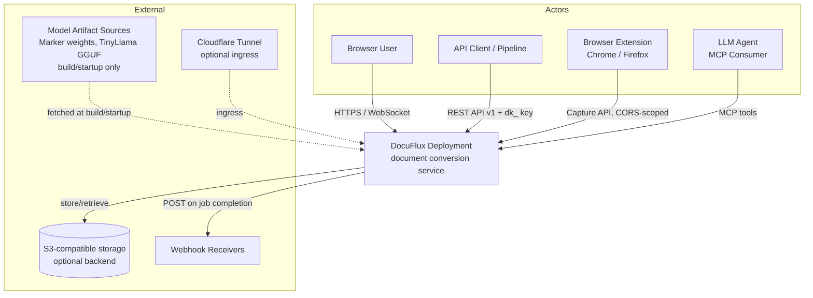
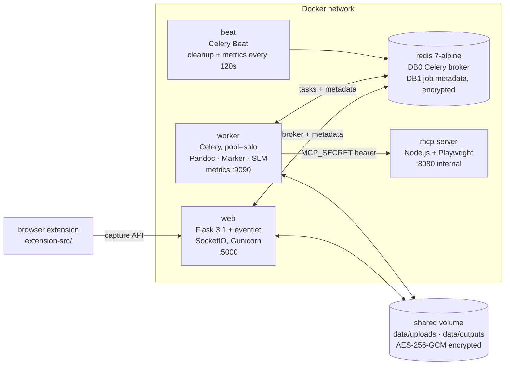
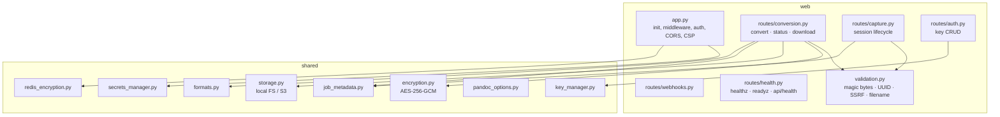
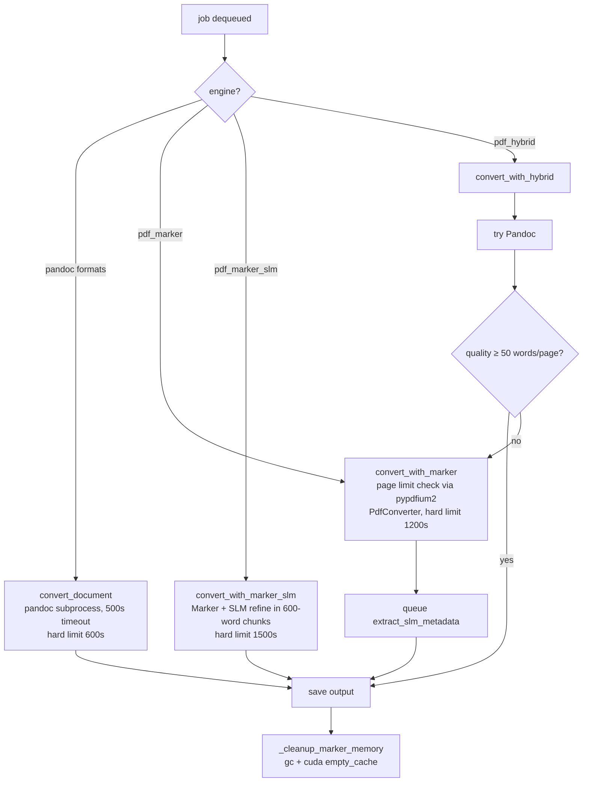
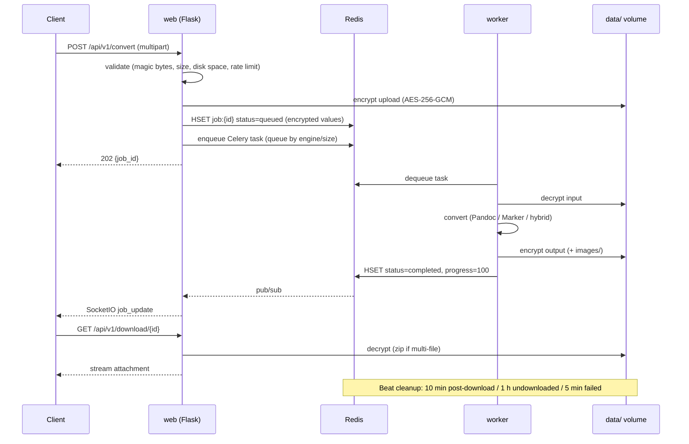
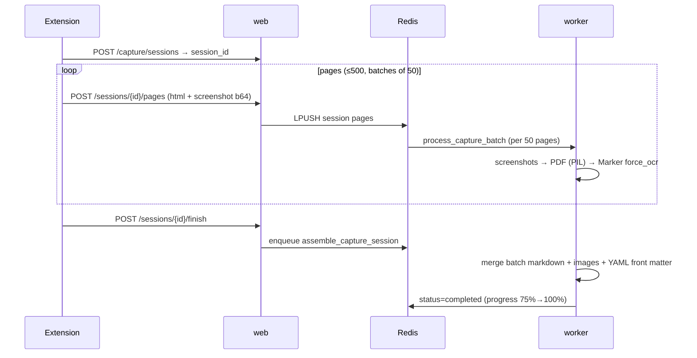
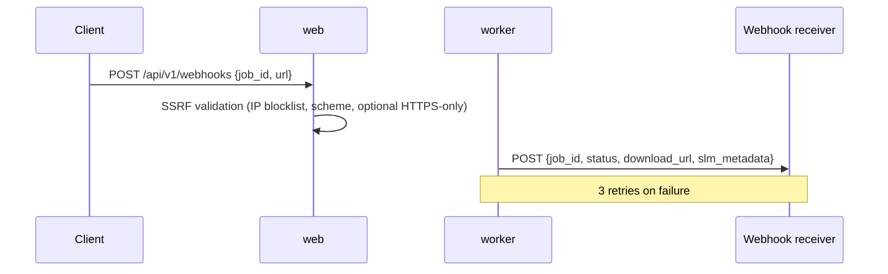
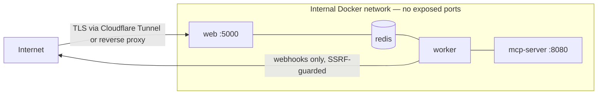

# DocuFlux — Architecture Document

**Status:** Current-state description · **Last updated:** 2026-06-11
**Related docs:** [PRD.md](PRD.md) · [BACKLOG.md](BACKLOG.md) · [API.md](API.md) · [CONFIGURATION.md](CONFIGURATION.md) · [DEPLOYMENT.md](DEPLOYMENT.md) · [AI_INTEGRATION.md](AI_INTEGRATION.md)

This document describes the system as it exists today, including known gaps. Planned changes are referenced by their [BACKLOG.md](BACKLOG.md) story IDs.

---

## 1. System Context (C4 Level 1)

Trust note: all conversion and metadata extraction is local. The only runtime egress is webhook delivery (SSRF-guarded, see §6.5).

---

## 2. Container View (C4 Level 2)

Five runtime containers plus the distributed browser extension:

### 2.1 `web` — Flask application (`web/`)

- Flask 3.1 with eventlet monkey-patching, Flask-SocketIO for real-time job updates, Gunicorn (eventlet worker class).
- Route blueprints: `routes/conversion.py` (convert/status/download), `routes/capture.py` (extension sessions), `routes/auth.py` (API keys), `routes/webhooks.py`, `routes/health.py`.
- Middleware: CSRF (Flask-WTF), rate limiting (Flask-Limiter backed by Redis), structured JSON logging with `X-Request-ID` correlation, ProxyFix behind `BEHIND_PROXY`.

### 2.2 `worker` — Celery worker (`worker/`)

- `pool=solo`, concurrency 1, `max_tasks_per_child=50`, `acks_late=True`, `reject_on_worker_lost=True`.
- 11 tasks across `tasks/conversion.py`, `tasks/capture.py`, `tasks/metadata.py`, `tasks/maintenance.py`.
- `warmup.py` detects GPU and eagerly loads the SLM; Marker models are lazy-loaded on first use (~30 s penalty — Backlog 6.2).
- Prometheus metrics on port 9090 (`metrics.py`).

### 2.3 `beat` — Celery Beat

- Schedules `cleanup_old_files` and `update_metrics` every 120 s (`tasks/__init__.py`).

### 2.4 `redis` — broker and metadata store

- DB 0: Celery broker + result backend; DB 1: job metadata hashes (values encrypted via `shared/redis_encryption.py`), capture sessions, API keys, rate-limit counters, dead-letter queue (`dlq:tasks`).
- `requirepass`, 256 MB `maxmemory` with `noeviction`, AOF persistence. **Known gap:** TLS is disabled pending certificate generation (Backlog 4.1); Sentinel HA supported via config.

### 2.5 `mcp-server` — Playwright automation (`mcp_server/`)

- Node.js HTTP server (internal port 8080) exposing browser actions; authenticated by `MCP_SECRET` bearer token; reachable only from the worker. **Known gaps:** runs as root, no container healthcheck (Backlog 4.5).

### 2.6 Browser extension (`extension-src/`)

- Chrome MV3 / Firefox MV2 manifests; DOMPurify for sanitization; Socket.IO client for progress; built via `scripts/build-extension.js`.

### 2.7 Inter-container contracts

| Contract | Definition |
|----------|------------|
| Celery task signatures | `tasks.convert_document`, `tasks.convert_with_marker`, `tasks.convert_with_marker_slm`, `tasks.convert_with_hybrid`, `tasks.process_capture_batch`, `tasks.assemble_capture_session`, `tasks.extract_slm_metadata`, maintenance tasks |
| Queue routing | Marker/SLM/hybrid → `gpu` queue; Pandoc < 5 MB → `high_priority`; Pandoc ≥ 5 MB → `default` |
| Redis key schema | `job:{uuid}` (hash), `capture:session:{uuid}`, `jobs:active`, `workers:status`, `dlq:tasks` |
| Worker→MCP | HTTP POST `http://mcp-server:8080/execute`, `Authorization: Bearer ${MCP_SECRET}` |

---

## 3. Component View (C4 Level 3)

### 3.1 Web components

### 3.2 Worker engine selection

The 50-words/page heuristic (`_assess_pandoc_quality`, `worker/tasks/conversion.py`) is the system's only quality measure — Backlog 1.1/1.2 replaces it with a structured scorer.

---

## 4. Data Flow Views

### 4.1 Standard conversion lifecycle

### 4.2 Browser capture assembly

### 4.3 Webhook delivery

### 4.4 Job metadata lifecycle (Redis DB 1)

States: `queued → in_progress → completed | failed`. Each `job:{uuid}` hash carries status, progress (0–100), stage, filenames, formats, engine, timestamps, and (post-Marker) SLM metadata — values encrypted at rest. TTLs and the Beat sweep enforce retention; failed tasks additionally land in `dlq:tasks` for inspection.

---

## 5. Deployment Topologies

### 5.1 Docker Compose variants

| File | Purpose | Key differences |
|------|---------|-----------------|
| `docker-compose.yml` | Base | redis, web, worker, beat, mcp-server; hardening defaults (non-root, cap_drop ALL, no-new-privileges, noexec tmpfs) |
| `docker-compose.gpu.yml` | GPU overlay | worker 16–18 GB memory, NVIDIA device reservation, `MARKER_ENABLED=true` |
| `docker-compose.cpu.yml` | CPU overlay | worker 2 GB memory, Marker disabled |
| `docker-compose.tls.yml` | Redis TLS overlay | **currently inert** — certs not generated (Backlog 4.1) |
| `docker-compose.cloudflare.yml` | Tunnel ingress | adds cloudflared container |

Build: `scripts/build.sh auto` detects GPU (`nvidia-smi`) and selects `BUILD_GPU`, which switches the worker base image (`nvidia/cuda:11.8.0-cudnn8` vs `ubuntu:22.04`) and requirements file (`requirements-gpu.txt` ~15 GB vs `requirements-false.txt` <3 GB).

### 5.2 Kubernetes (`deploy/k8s/`)

Namespace, registry secret, Redis StatefulSet, web Deployment (2 replicas + HPA 1–10), worker Deployments (CPU and GPU variants + HPA), NetworkPolicies restricting inter-pod traffic. Manifests are not validated in CI (Backlog 5.4 adjacent).

### 5.3 Hardware capability matrix

| Capability | GPU profile | CPU profile |
|------------|-------------|-------------|
| Pandoc conversion | ✅ | ✅ |
| Marker PDF→Markdown | ✅ | ❌ |
| Scanned PDF (OCR) | ✅ (Marker) | ❌ — no fallback (Backlog Epic 2) |
| SLM metadata | ✅ (GPU layers) | ✅ (slower) |
| Capture assembly (OCR path) | ✅ | ❌ degraded |

---

## 6. Security Architecture

### 6.1 Trust boundaries

### 6.2 Authentication & authorization

- **API keys:** `dk_`-prefixed, created/revoked via `/api/v1/auth/keys` under `ADMIN_API_SECRET` bearer auth; stored hashed (`shared/key_manager.py`); presented as `X-API-Key`. **Gap:** no expiration or usage audit log (Backlog 4.3).
- **Sessions:** `HTTPONLY`, `SameSite=Lax`; `SESSION_COOKIE_SECURE` opt-in (must be enabled behind HTTPS).
- **CSRF:** Flask-WTF on browser-facing routes.
- **MCP:** bearer-token (`MCP_SECRET`) on an internal-only endpoint.

### 6.3 Encryption

- **Files at rest:** AES-256-GCM with per-job DEKs wrapped by `MASTER_ENCRYPTION_KEY` (`shared/encryption.py`).
- **Redis payloads:** job metadata values encrypted (`shared/redis_encryption.py`).
- **Key sourcing:** Docker secrets → env vars → `.env` (`shared/secrets_manager.py`); fail-fast in production if absent; ephemeral keys auto-generated in dev.
- **Gaps:** Redis transport TLS disabled (Backlog 4.1); no documented key-rotation procedure; crypto modules excluded from test coverage (Backlog 5.1).

### 6.4 Input validation (`web/validation.py`)

UUID v4 validation, filename sanitization (path-traversal defense), magic-byte content checks (PDF `%PDF`, ZIP `PK`, text-encoding probes), upload size and free-disk enforcement. **Gap:** magic check reads only the first 8 bytes — polyglot files can pass (Backlog 4.4).

### 6.5 Network protections

- Rate limiting: Flask-Limiter (Redis-backed), defaults 1000/day + 200/hour, per-endpoint overrides on capture routes. **Gap:** `/api/v1/convert` lacks an explicit decorator (Backlog 4.2).
- SSRF: webhook URLs validated against IP blocklists/schemes; optional HTTPS-only enforcement.
- CORS: capture endpoints only, restricted to extension origins.
- CSP: set in `app.py`, but includes `unsafe-inline` for SocketIO compatibility (Backlog 4.6).

### 6.6 Container hardening

Non-root users in web and worker images; `cap_drop: [ALL]`; `no-new-privileges`; `tmpfs /tmp noexec,nosuid,nodev`; Redis unexposed and password-protected. **Gaps:** `python:3.11-slim` / `ubuntu:22.04` base images unpinned (Backlog 5.2); MCP container runs as root with no healthcheck (Backlog 4.5).

### 6.7 OSCAL control mapping

`oscal/component-definition.json` and `oscal/ssp.json` map mechanisms to NIST SP 800-53 controls (AC-2/AC-3 → API keys, AU-2 → logging, SC-8 → transport encryption, SC-28 → encryption at rest), validated by `.github/workflows/oscal-validate.yml`. Closing Epic 4 gaps should update the corresponding SSP statements (Backlog 5.5).

---

## 7. Cross-Cutting Concerns

### 7.1 Observability

- **Logging:** web tier emits structured JSON with request-ID correlation; **worker logs are unstructured plain text** (Backlog 3.5).
- **Metrics:** Prometheus counters/histograms/gauges in `worker/metrics.py` (conversion totals/durations/failures, GPU utilization, queue depth) + `prometheus-flask-exporter` on web; Grafana dashboard and alert rules in `docs/`.
- **Healthchecks:** `/healthz`, `/readyz`, `/api/health` on web. **Known bug:** the worker container's Docker healthcheck targets the MCP server's endpoint, not the worker itself (Backlog 3.2).

### 7.2 Configuration

Single Pydantic Settings class (`config.py`); precedence Docker secrets → environment → `.env` → defaults; `SecretStr` for all credentials. Full reference: [CONFIGURATION.md](CONFIGURATION.md).

### 7.3 Model lifecycle

- Marker models: lazy `create_model_dict()` on first conversion (~30 s), cached per worker process (recycled every 50 tasks via `max_tasks_per_child`).
- SLM (TinyLlama GGUF): eagerly loaded at worker start (`warmup.py`), GPU layers when available.
- GPU memory: explicit `gc.collect()` + `torch.cuda.empty_cache()` after Marker tasks; fragmentation can still accumulate (Backlog 6.6).

---

## 8. Architecture Decision Records (retroactive)

### ADR-001: Eventlet + Flask-SocketIO for real-time updates
**Decision:** Use Flask with eventlet monkey-patching and Flask-SocketIO rather than an ASGI stack.
**Rationale:** WebSocket progress with minimal divergence from a conventional Flask app; Redis message queue lets multiple web replicas broadcast.
**Consequences:** Eventlet is in maintenance mode upstream; CSP needs `unsafe-inline` accommodations; future migration to gevent/threading or ASGI may be required (PRD §10).

### ADR-002: Celery `pool=solo`, concurrency 1
**Decision:** One task at a time per worker process.
**Rationale:** Marker and the SLM contend for a single GPU; serializing avoids VRAM exhaustion and CUDA context conflicts. `max_tasks_per_child=50` bounds memory creep.
**Consequences:** Head-of-line blocking — a 20-minute Marker job stalls Pandoc and maintenance tasks. Mitigation: queue separation with a light-lane worker (Backlog 6.3).

### ADR-003: Redis as the only datastore
**Decision:** Job metadata, capture sessions, API keys, and rate limits all live in Redis; no RDBMS.
**Rationale:** Jobs are transient by design (retention minutes-to-hours); Redis already serves as Celery broker; one fewer stateful service to operate.
**Consequences:** No relational querying or long-term history; durability depends on AOF; `noeviction` at 256 MB means load spikes surface as write errors rather than silent data loss.

### ADR-004: Envelope encryption at rest
**Decision:** AES-256-GCM with per-job data-encryption keys wrapped by a master key, applied to files and Redis metadata values.
**Rationale:** Confidentiality on shared volumes and in Redis dumps; per-job DEKs limit blast radius; GCM provides integrity.
**Consequences:** Key management is the critical path (rotation undocumented); crypto code must be test-covered (currently excluded — Backlog 5.1); CPU overhead on every file touch.

### ADR-005: Hybrid engine with words/page heuristic
**Decision:** `pdf_hybrid` tries Pandoc first and falls back to Marker when output is below 50 words/page.
**Rationale:** Pandoc is orders of magnitude cheaper; only pay GPU cost when fast conversion visibly fails.
**Consequences:** The heuristic misses degradation that preserves word count (mangled tables, shuffled columns, garbage characters) and wastes Marker runs on legitimately sparse documents. Superseded by quality scoring (Backlog 1.1/1.2).

---

## 9. Known Limitations and Planned Evolution

| Limitation | Where | Planned evolution |
|------------|-------|-------------------|
| No quality signal on conversions | `worker/tasks/conversion.py`, API responses | [Backlog Epic 1](BACKLOG.md#epic-1) — scoring, smarter routing, quality in API |
| No OCR on CPU deployments | worker CPU image | [Backlog Epic 2](BACKLOG.md#epic-2) — Tesseract fallback + routing |
| Silent partial failures, temp-file leaks, healthcheck bug | worker tasks, compose | [Backlog Epic 3](BACKLOG.md#epic-3) |
| Redis TLS off, key lifecycle, shallow validation, MCP root | redis, key_manager, validation, mcp_server | [Backlog Epic 4](BACKLOG.md#epic-4) |
| Untested crypto, unpinned images, no lint/SAST/scan/SBOM | `.coveragerc`, Dockerfiles, CI | [Backlog Epic 5](BACKLOG.md#epic-5) |
| Cold-start latency, head-of-line blocking, memory-bound I/O | warmup, queues, storage | [Backlog Epic 6](BACKLOG.md#epic-6) |
