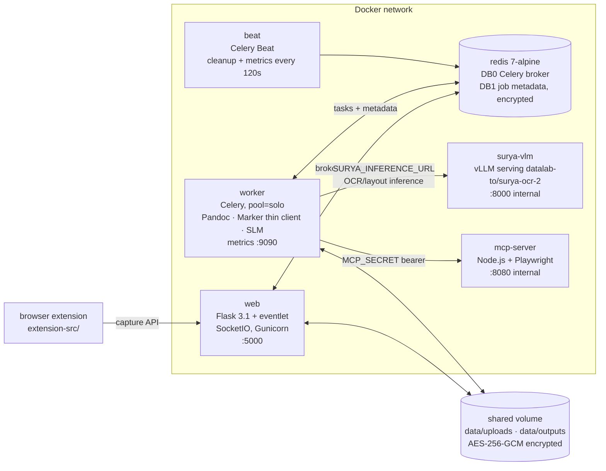
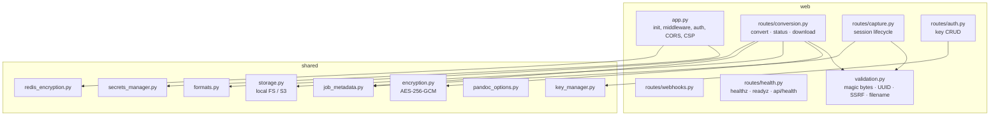
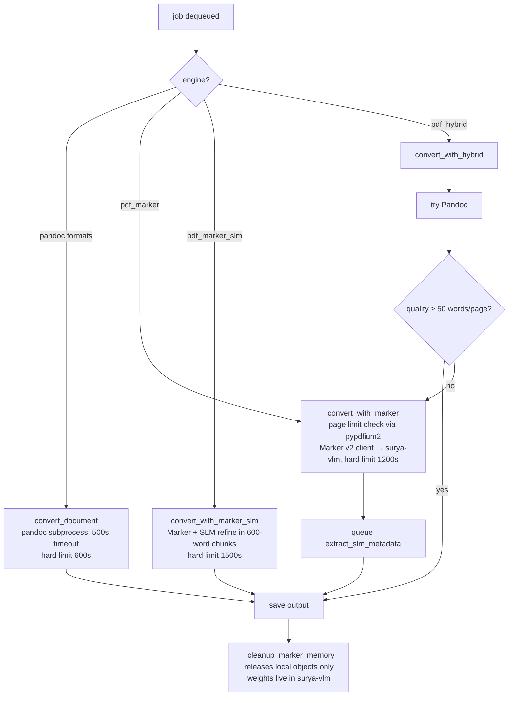
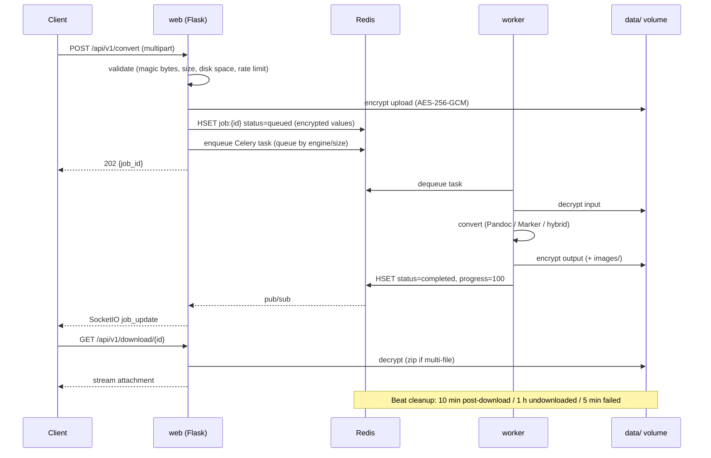
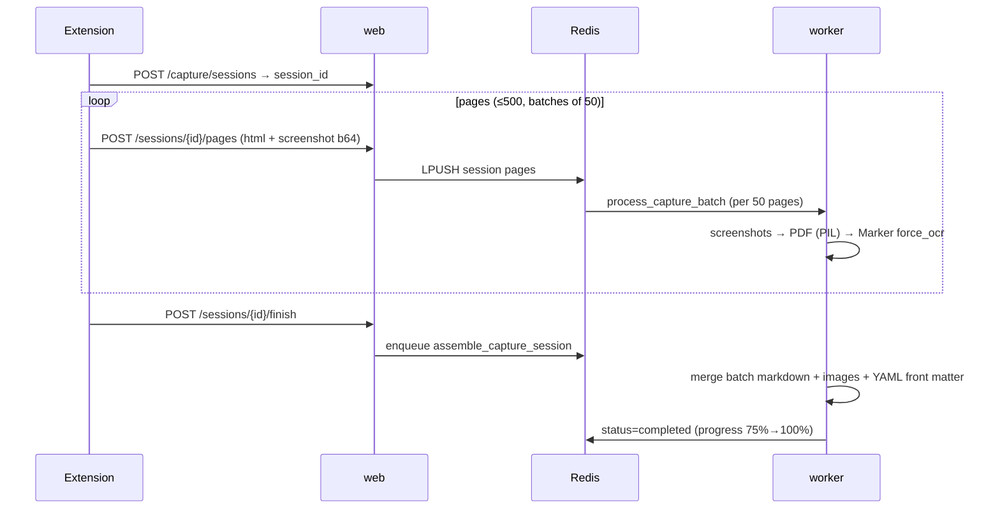
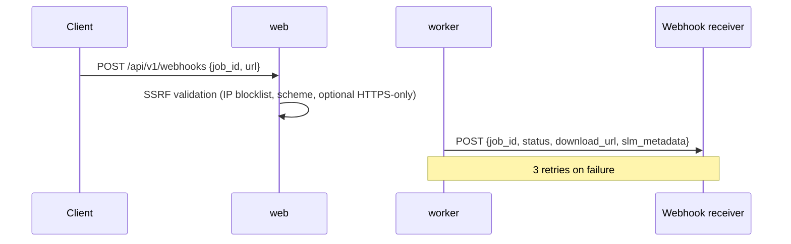
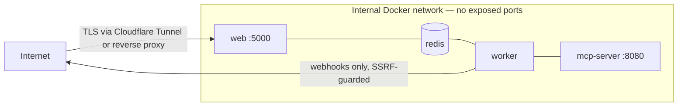

# DocuFlux — Architecture Document

**Status:** Current-state description · **Last updated:** 2026-06-11
**Related docs:** [PRD.md](PRD.md) · [BACKLOG.md](user-stories/BACKLOG.md) · [API.md](API.md) · [CONFIGURATION.md](CONFIGURATION.md) · [DEPLOYMENT.md](DEPLOYMENT.md) · [AI_INTEGRATION.md](AI_INTEGRATION.md)

This document describes the system as it exists today, including known gaps. Planned changes are referenced by their [BACKLOG.md](user-stories/BACKLOG.md) story IDs.

---

## 1. System Context (C4 Level 1)

```mermaid
flowchart TB
    subgraph Actors
        U[Browser User]
        A[API Client / Pipeline]
        E[Browser Extension<br/>Chrome / Firefox]
        G[LLM Agent<br/>MCP Consumer]
    end

    DF[DocuFlux Deployment<br/>document conversion service]

    subgraph External
        S3[(S3-compatible storage<br/>optional backend)]
        WH[Webhook Receivers]
        MS[Model Artifact Sources<br/>Surya OCR weights (surya-vlm)<br/>TinyLlama GGUF (worker)<br/>fetched at startup only]
        CF[Cloudflare Tunnel<br/>optional ingress]
    end

    U -->|HTTPS / WebSocket| DF
    A -->|REST API v1 + dk_ key| DF
    E -->|Capture API, CORS-scoped| DF
    G -->|MCP tools| DF
    DF -->|store/retrieve| S3
    DF -->|POST on job completion| WH
    MS -.->|fetched at build/startup| DF
    CF -.->|ingress| DF
```

Trust note: all conversion and metadata extraction is local. The only runtime egress is webhook delivery (SSRF-guarded, see §6.5).

---

## 2. Container View (C4 Level 2)

Six runtime containers plus the distributed browser extension:

```mermaid
flowchart LR
    subgraph Docker network
        WEB[web<br/>Flask 3.1 + eventlet<br/>SocketIO, Gunicorn<br/>:5000]
        RED[(redis 7-alpine<br/>DB0 Celery broker<br/>DB1 job metadata, encrypted)]
        WRK[worker<br/>Celery, pool=solo<br/>Pandoc · Marker thin client · SLM<br/>metrics :9090]
        SVLM[surya-vlm<br/>vLLM serving datalab-to/surya-ocr-2<br/>:8000 internal]
        BEAT[beat<br/>Celery Beat<br/>cleanup + metrics every 120s]
        MCP[mcp-server<br/>Node.js + Playwright<br/>:8080 internal]
    end
    EXT[browser extension<br/>extension-src/]
    VOL[(shared volume<br/>data/uploads · data/outputs<br/>AES-256-GCM encrypted)]

    EXT -->|capture API| WEB
    WEB <-->|broker + metadata| RED
    WRK <-->|tasks + metadata| RED
    BEAT --> RED
    WRK -->|MCP_SECRET bearer| MCP
    WRK -->|SURYA_INFERENCE_URL<br/>OCR/layout inference| SVLM
    WEB <--> VOL
    WRK <--> VOL
```

### 2.1 `web` — Flask application (`web/`)

- Flask 3.1 with eventlet monkey-patching, Flask-SocketIO for real-time job updates, Gunicorn (eventlet worker class).
- Route blueprints: `routes/conversion.py` (convert/status/download), `routes/capture.py` (extension sessions), `routes/auth.py` (API keys), `routes/webhooks.py`, `routes/health.py`.
- Middleware: CSRF (Flask-WTF), rate limiting (Flask-Limiter backed by Redis), structured JSON logging with `X-Request-ID` correlation, ProxyFix behind `BEHIND_PROXY`.

### 2.2 `worker` — Celery worker (`worker/`)

- `pool=solo`, concurrency 1, `max_tasks_per_child=50`, `acks_late=True`, `reject_on_worker_lost=True`.
- 11 tasks across `tasks/conversion.py`, `tasks/capture.py`, `tasks/metadata.py`, `tasks/maintenance.py`.
- `warmup.py` detects GPU, eagerly loads the SLM, and probes the shared Surya inference server (`check_inference_server()`); Marker model weights live in the `surya-vlm` process — the worker is a thin client whose artifact dict is lazily created on first conversion (fast, ~1 s).
- Prometheus metrics on port 9090 (`metrics.py`).

### 2.3 `beat` — Celery Beat

- Schedules `cleanup_old_files` and `update_metrics` every 120 s (`tasks/__init__.py`).

### 2.4 `redis` — broker and metadata store

- DB 0: Celery broker + result backend; DB 1: job metadata hashes (values encrypted via `shared/redis_encryption.py`), capture sessions, API keys, rate-limit counters, dead-letter queue (`dlq:tasks`).
- `requirepass`, 256 MB `maxmemory` with `noeviction`, AOF persistence. **Known gap:** TLS is disabled pending certificate generation (Backlog 4.1); Sentinel HA supported via config.

### 2.5 `mcp-server` — Playwright automation (`mcp_server/`)

- Node.js HTTP server (internal port 8080) exposing browser actions; authenticated by `MCP_SECRET` bearer token; reachable only from the worker. Runs as `pwuser` with a container healthcheck (Backlog 4.5, done).

### 2.6 Browser extension (`extension-src/`)

- Chrome MV3 / Firefox MV2 manifests; DOMPurify for sanitization; Socket.IO client for progress; built via `scripts/build-extension.js`.

### 2.7 Inter-container contracts

| Contract | Definition |
|----------|------------|
| Celery task signatures | `tasks.convert_document`, `tasks.convert_with_marker`, `tasks.convert_with_marker_slm`, `tasks.convert_with_hybrid`, `tasks.process_capture_batch`, `tasks.assemble_capture_session`, `tasks.extract_slm_metadata`, maintenance tasks |
| Queue routing | Marker/SLM/hybrid → `gpu` queue; Pandoc < 5 MB → `high_priority`; Pandoc ≥ 5 MB → `default` |
| Redis key schema | `job:{uuid}` (hash), `capture:session:{uuid}`, `jobs:active`, `workers:status`, `dlq:tasks` |
| Worker→MCP | HTTP POST `http://mcp-server:8080/execute`, `Authorization: Bearer ${MCP_SECRET}` |
| Worker→inference server | Marker v2 thin client → `SURYA_INFERENCE_URL` (default `http://surya-vlm:8000`), `SURYA_INFERENCE_AUTOSTART=false`; server exposes internal port 8000 with `/health` |

---

## 3. Component View (C4 Level 3)

### 3.1 Web components

```mermaid
flowchart TB
    subgraph web
        APP[app.py<br/>init, middleware, auth, CORS, CSP]
        CONV[routes/conversion.py<br/>convert · status · download]
        CAP[routes/capture.py<br/>session lifecycle]
        AUTH[routes/auth.py<br/>key CRUD]
        WHK[routes/webhooks.py]
        HLT[routes/health.py<br/>healthz · readyz · api/health]
        VAL[validation.py<br/>magic bytes · UUID · SSRF · filename]
    end
    subgraph shared
        ENC[encryption.py<br/>AES-256-GCM]
        STO[storage.py<br/>local FS / S3]
        KEY[key_manager.py]
        JMD[job_metadata.py]
        RENC[redis_encryption.py]
        FMT[formats.py]
        POPT[pandoc_options.py]
        SEC[secrets_manager.py]
    end
    CONV --> VAL & ENC & STO & JMD & FMT
    CAP --> VAL & JMD
    AUTH --> KEY
    APP --> SEC & RENC
```

### 3.2 Worker engine selection

```mermaid
flowchart TB
    REQ[job dequeued] --> Q{engine?}
    Q -->|pandoc formats| P[convert_document<br/>pandoc subprocess, 500s timeout<br/>hard limit 600s]
    Q -->|pdf_marker| M[convert_with_marker<br/>page limit check via pypdfium2<br/>Marker v2 client → surya-vlm, hard limit 1200s]
    Q -->|pdf_marker_slm| MS[convert_with_marker_slm<br/>Marker + SLM refine in 600-word chunks<br/>hard limit 1500s]
    Q -->|pdf_hybrid| H[convert_with_hybrid]
    H --> HP[try Pandoc]
    HP --> QC{quality ≥ 50 words/page?}
    QC -->|yes| DONE[save output]
    QC -->|no| M
    M --> SLMQ[queue extract_slm_metadata]
    MS --> DONE
    P --> DONE
    SLMQ --> DONE
    DONE --> CLN[_cleanup_marker_memory<br/>releases local objects only<br/>weights live in surya-vlm]
```

The hybrid fallback decision uses the Story 1.1 quality scorer: Pandoc output passes when its score meets the configured `HYBRID_QUALITY_THRESHOLD` (default 60), otherwise the job falls back to Marker (`_assess_pandoc_quality`, `worker/tasks/conversion.py`).

---

## 4. Data Flow Views

### 4.1 Standard conversion lifecycle

```mermaid
sequenceDiagram
    participant C as Client
    participant W as web (Flask)
    participant R as Redis
    participant K as worker
    participant V as data/ volume

    C->>W: POST /api/v1/convert (multipart)
    W->>W: validate (magic bytes, size, disk space, rate limit)
    W->>V: encrypt upload (AES-256-GCM)
    W->>R: HSET job:{id} status=queued (encrypted values)
    W->>R: enqueue Celery task (queue by engine/size)
    W-->>C: 202 {job_id}
    K->>R: dequeue task
    K->>V: decrypt input
    K->>K: convert (Pandoc / Marker / hybrid)
    K->>V: encrypt output (+ images/)
    K->>R: HSET status=completed, progress=100
    R-->>W: pub/sub
    W-->>C: SocketIO job_update
    C->>W: GET /api/v1/download/{id}
    W->>V: decrypt (zip if multi-file)
    W-->>C: stream attachment
    Note over R,V: Beat cleanup: 10 min post-download / 1 h undownloaded / 5 min failed
```

### 4.2 Browser capture assembly

```mermaid
sequenceDiagram
    participant E as Extension
    participant W as web
    participant R as Redis
    participant K as worker

    E->>W: POST /capture/sessions → session_id
    loop pages (≤500, batches of 50)
        E->>W: POST /sessions/{id}/pages (html + screenshot b64)
        W->>R: LPUSH session pages
        R->>K: process_capture_batch (per 50 pages)
        K->>K: screenshots → PDF (PIL) → Marker force_ocr
    end
    E->>W: POST /sessions/{id}/finish
    W->>R: enqueue assemble_capture_session
    K->>K: merge batch markdown + images + YAML front matter
    K->>R: status=completed (progress 75%→100%)
```

### 4.3 Webhook delivery

```mermaid
sequenceDiagram
    participant C as Client
    participant W as web
    participant K as worker
    participant H as Webhook receiver

    C->>W: POST /api/v1/webhooks {job_id, url}
    W->>W: SSRF validation (IP blocklist, scheme, optional HTTPS-only)
    K->>H: POST {job_id, status, download_url, slm_metadata}
    Note over K,H: 3 retries on failure
```

### 4.4 Job metadata lifecycle (Redis DB 1)

States: `queued → in_progress → completed | failed`. Each `job:{uuid}` hash carries status, progress (0–100), stage, filenames, formats, engine, timestamps, and (post-Marker) SLM metadata — values encrypted at rest. TTLs and the Beat sweep enforce retention; failed tasks additionally land in `dlq:tasks` for inspection.

---

## 5. Deployment Topologies

### 5.1 Docker Compose variants

| File | Purpose | Key differences |
|------|---------|-----------------|
| `docker-compose.yml` | Base | redis, web, worker, beat, mcp-server, **surya-vlm** (the base deployment is the GPU topology — the worker reserves an NVIDIA device, drains the `gpu` queue, and attaches to the inference server via `SURYA_INFERENCE_URL`); hardening defaults (non-root, cap_drop ALL, no-new-privileges, noexec tmpfs) |
| `docker-compose.gpu.yml` | GPU overlay | worker 16–18 GB memory, NVIDIA device reservation, `MARKER_ENABLED=true`; same `surya-vlm` image/env/probes as base, gated behind the `gpu` profile |
| `docker-compose.cpu.yml` | CPU overlay | worker 2 GB memory, Marker disabled; `surya-vlm` removed from the default service set (never-activated profile) so CPU-only hosts never allocate a GPU |
| `docker-compose.tls.yml` | Redis TLS overlay | **currently inert** — certs not generated (Backlog 4.1) |
| `docker-compose.cloudflare.yml` | Tunnel ingress | adds cloudflared container |

Build: `scripts/build.sh auto` detects GPU (`nvidia-smi`) and selects `BUILD_GPU`, which switches the worker base image (`nvidia/cuda:11.8.0-cudnn8` vs `ubuntu:22.04`) and requirements file (`requirements-true.txt` ~15 GB vs `requirements-false.txt` <3 GB).

### 5.2 Kubernetes (`deploy/k8s/`)

Namespace, registry secret, Redis StatefulSet, web Deployment (2 replicas + HPA 1–10), worker Deployments (CPU and GPU variants + HPA), NetworkPolicies restricting inter-pod traffic. Manifests are not validated in CI (Backlog 5.4 adjacent).

### 5.3 Hardware capability matrix

| Capability | GPU profile | CPU profile |
|------------|-------------|-------------|
| Pandoc conversion | ✅ | ✅ |
| Marker PDF→Markdown | ✅ | ❌ |
| Scanned PDF (OCR) | ✅ (Marker) | ❌ — no fallback (Backlog Epic 2) |
| SLM metadata | ✅ (GPU layers) | ✅ (slower) |
| Capture assembly (OCR path) | ✅ | ❌ degraded |

---

## 6. Security Architecture

### 6.1 Trust boundaries

```mermaid
flowchart LR
    NET[Internet] -->|TLS via Cloudflare Tunnel or reverse proxy| WEB[web :5000]
    subgraph internal[Internal Docker network — no exposed ports]
        WEB --- RED[(redis)]
        RED --- WRK[worker]
        WRK --- MCP[mcp-server :8080]
    end
    WRK -->|webhooks only, SSRF-guarded| NET
```

### 6.2 Authentication & authorization

- **API keys:** `dk_`-prefixed, created/revoked via `/api/v1/auth/keys` under `ADMIN_API_SECRET` bearer auth; stored hashed (`shared/key_manager.py`); presented as `X-API-Key`. **Gap:** no expiration or usage audit log (Backlog 4.3).
- **Sessions:** `HTTPONLY`, `SameSite=Lax`; `SESSION_COOKIE_SECURE` opt-in (must be enabled behind HTTPS).
- **CSRF:** Flask-WTF on browser-facing routes.
- **MCP:** bearer-token (`MCP_SECRET`) on an internal-only endpoint.

### 6.3 Encryption

- **Files at rest:** AES-256-GCM with per-job DEKs wrapped by `MASTER_ENCRYPTION_KEY` (`shared/encryption.py`).
- **Redis payloads:** job metadata values encrypted (`shared/redis_encryption.py`).
- **Key sourcing:** Docker secrets → env vars → `.env` (`shared/secrets_manager.py`); fail-fast in production if absent; ephemeral keys auto-generated in dev.
- **Gaps:** Redis transport TLS disabled (Backlog 4.1); no documented key-rotation procedure; crypto modules excluded from test coverage (Backlog 5.1).

### 6.4 Input validation (`web/validation.py`)

UUID v4 validation, filename sanitization (path-traversal defense), magic-byte content checks (PDF `%PDF`, ZIP `PK`, text-encoding probes), upload size and free-disk enforcement. **Gap:** magic check reads only the first 8 bytes — polyglot files can pass (Backlog 4.4).

### 6.5 Network protections

- Rate limiting: Flask-Limiter (Redis-backed), defaults 1000/day + 200/hour, per-endpoint overrides on capture routes. **Gap:** `/api/v1/convert` lacks an explicit decorator (Backlog 4.2).
- SSRF: webhook URLs validated against IP blocklists/schemes; optional HTTPS-only enforcement.
- CORS: capture endpoints only, restricted to extension origins.
- CSP: set in `app.py`, but includes `unsafe-inline` for SocketIO compatibility (Backlog 4.6).

### 6.6 Container hardening

Non-root users in web and worker images; `cap_drop: [ALL]`; `no-new-privileges`; `tmpfs /tmp noexec,nosuid,nodev`; Redis unexposed and password-protected. Base images are pinned by digest (Backlog 5.2, done) and the MCP container runs non-root with a healthcheck (Backlog 4.5, done).

### 6.7 OSCAL control mapping

`oscal/component-definition.json` and `oscal/ssp.json` map mechanisms to NIST SP 800-53 controls (AC-2/AC-3 → API keys, AU-2 → logging, SC-8 → transport encryption, SC-28 → encryption at rest), validated by `.github/workflows/oscal-validate.yml`. Closing Epic 4 gaps should update the corresponding SSP statements (Backlog 5.5).

---

## 7. Cross-Cutting Concerns

### 7.1 Observability

- **Logging:** web tier emits structured JSON with request-ID correlation; **worker logs are unstructured plain text** (Backlog 3.5).
- **Metrics:** Prometheus counters/histograms/gauges in `worker/metrics.py` (conversion totals/durations/failures, GPU utilization, queue depth) + `prometheus-flask-exporter` on web; Grafana dashboard and alert rules in `docs/`.
- **Healthchecks:** `/healthz`, `/readyz`, `/api/health` on web. **Known bug:** the worker container's Docker healthcheck targets the MCP server's endpoint, not the worker itself (Backlog 3.2).

### 7.2 Configuration

Single Pydantic Settings class (`config.py`); precedence Docker secrets → environment → `.env` → defaults; `SecretStr` for all credentials. Full reference: [CONFIGURATION.md](CONFIGURATION.md).

### 7.3 Model lifecycle

- Marker (v2, `marker-pdf 2.0.0`): the worker is a thin client attaching to the shared `surya-vlm` inference server via `SURYA_INFERENCE_URL` (`SURYA_INFERENCE_AUTOSTART=false` — the deployment owns the server). A lazy `create_model_dict()` builds the client-side artifact dict on first conversion per worker process (~1 s; the ~30 s in-process weight load of v1 is gone); it is cached for the process's lifetime (recycled every 50 tasks via `max_tasks_per_child`). Model weights live in the server process, sized by `VLLM_GPU_MEMORY_UTILIZATION`.
- SLM (TinyLlama GGUF): eagerly loaded at worker start (`warmup.py`), GPU layers when available.
- GPU memory: `_cleanup_marker_memory()` after every Marker task releases only the worker's local objects (`gc.collect()`); `torch.cuda.empty_cache()` would act on a worker-local CUDA context that no longer holds model weights, so it is not used. Weights live in the `surya-vlm` process, whose VRAM footprint is managed server-side; `shutdown_marker_models()` at worker shutdown is a no-op when attached to a remote server. Residual risk (server-side state) is addressed by the recycling decision below.

#### Inference server recycling

**Decision:** recycle the shared `surya-vlm` server on a bounded deployment schedule; never from the worker.

Workers already recycle their own process every 50 tasks (`max_tasks_per_child=50`), but that only bounds worker-process memory. The shared vLLM server is a separate long-lived process, and `benchmarks/marker_v2/REPORT.md` observed one silent degeneration (a 14× repetition loop) on the tenth document of a sequential batch — evidence of state accumulating in the shared server rather than in the client. Worker-driven teardown is the wrong tool: many thin workers share one server, and `tests/unit/test_worker.py` pins that a completed conversion must NOT stop it.

**Mechanism:** Compose — `docker compose restart surya-vlm` on a schedule (e.g. daily cron/systemd timer); `restart: unless-stopped` recovers crashes. Kubernetes — `kubectl rollout restart deployment/surya-vlm -n docuflux` on a schedule; `restartPolicy: Always` recovers crashes. The output-quality bound (`excess_output` in `shared/quality.py`) is the first line of defense against a degenerate run, and periodic recycling bounds how long a silent degradation can persist. Rationale is pinned in-manifest in `docker-compose.yml` and `deploy/k8s/surya-vlm.yaml`.

---

## 8. Architecture Decision Records (retroactive)

### ADR-001: Eventlet + Flask-SocketIO for real-time updates
**Decision:** Use Flask with eventlet monkey-patching and Flask-SocketIO rather than an ASGI stack.
**Rationale:** WebSocket progress with minimal divergence from a conventional Flask app; Redis message queue lets multiple web replicas broadcast.
**Consequences:** Eventlet is in maintenance mode upstream; CSP needs `unsafe-inline` accommodations; future migration to gevent/threading or ASGI may be required (PRD §10).

### ADR-002: Celery `pool=solo`, concurrency 1
**Decision:** One task at a time per worker process (GPU workers run `--concurrency=2` since marker 2 — see ADR-002a).
**Rationale:** Marker and the SLM contend for a single GPU; serializing avoids VRAM exhaustion and CUDA context conflicts. `max_tasks_per_child=50` bounds memory creep.
**Consequences:** Head-of-line blocking — a 20-minute Marker job stalls Pandoc and maintenance tasks. Mitigation: queue separation with a light-lane worker (Backlog 6.3).

### ADR-002a: Shared Surya VLM inference server (marker 2)
**Decision:** Marker 2 model weights live in a dedicated `surya-vlm` service (vLLM serving `datalab-to/surya-ocr-2`); workers attach via `SURYA_INFERENCE_URL=http://surya-vlm:8000` with `SURYA_INFERENCE_AUTOSTART=false`.
**Rationale:** The VLM owns the GPU once, and many thin workers share it; workers hold no CUDA context for the VLM, so GPU worker concurrency can rise (2 in k8s) without multiplying VRAM.
**Consequences:** The inference server is a new single point of failure — if it is down, every marker/hybrid job fails at attach time; the server must be healthy before workers can convert. Per-task `torch.cuda.empty_cache()` no longer applies (see §7.3).

### ADR-003: Redis as the only datastore
**Decision:** Job metadata, capture sessions, API keys, and rate limits all live in Redis; no RDBMS.
**Rationale:** Jobs are transient by design (retention minutes-to-hours); Redis already serves as Celery broker; one fewer stateful service to operate.
**Consequences:** No relational querying or long-term history; durability depends on AOF; `noeviction` at 256 MB means load spikes surface as write errors rather than silent data loss.

### ADR-004: Envelope encryption at rest
**Decision:** AES-256-GCM with per-job data-encryption keys wrapped by a master key, applied to files and Redis metadata values.
**Rationale:** Confidentiality on shared volumes and in Redis dumps; per-job DEKs limit blast radius; GCM provides integrity.
**Consequences:** Key management is the critical path (rotation undocumented); crypto code must be test-covered (currently excluded — Backlog 5.1); CPU overhead on every file touch.

### ADR-005: Hybrid engine with quality-score threshold
**Decision:** `pdf_hybrid` tries Pandoc first and falls back to Marker when the Story 1.1 quality scorer rates the output below `HYBRID_QUALITY_THRESHOLD` (default 60).
**Rationale:** Pandoc is orders of magnitude cheaper; only pay GPU cost when fast conversion visibly fails.
**Consequences:** The scorer catches degradation the old words/page count missed (mangled tables, shuffled columns, garbage characters). Marker 2 makes the fallback cheaper to run: the VLM server is already warm, so the first fallback no longer pays a ~30 s model load.

---

## 9. Known Limitations and Planned Evolution

| Limitation | Where | Planned evolution |
|------------|-------|-------------------|
| No quality signal on conversions | `worker/tasks/conversion.py`, API responses | [Backlog Epic 1](user-stories/BACKLOG.md#epic-1) — scoring, smarter routing, quality in API |
| No OCR on CPU deployments | worker CPU image | [Backlog Epic 2](user-stories/BACKLOG.md#epic-2) — Tesseract fallback + routing |
| Silent partial failures, temp-file leaks, healthcheck bug | worker tasks, compose | [Backlog Epic 3](user-stories/BACKLOG.md#epic-3) |
| Redis TLS off, key lifecycle, shallow validation, MCP root | redis, key_manager, validation, mcp_server | [Backlog Epic 4](user-stories/BACKLOG.md#epic-4) |
| Untested crypto, unpinned images, no lint/SAST/scan/SBOM | `.coveragerc`, Dockerfiles, CI | [Backlog Epic 5](user-stories/BACKLOG.md#epic-5) |
| Cold-start latency, head-of-line blocking, memory-bound I/O | warmup, queues, storage | [Backlog Epic 6](user-stories/BACKLOG.md#epic-6) |
