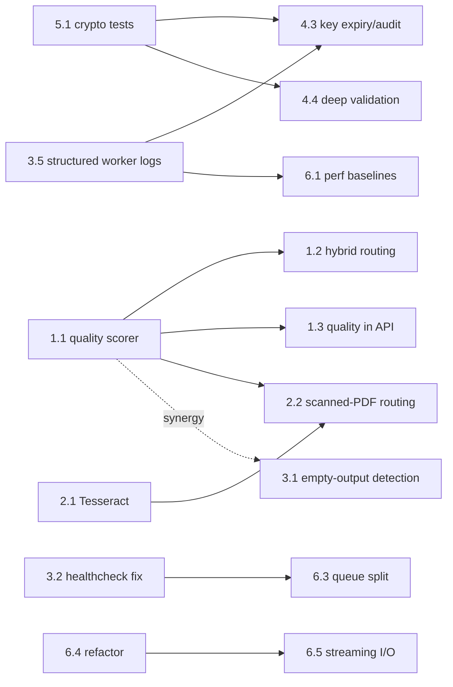

# DocuFlux — Improvement Epic Backlog

**Status:** Proposed · **Last updated:** 2026-06-11
**Related docs:** [PRD.md](../PRD.md) · [ARCHITECTURE.md](../ARCHITECTURE.md)

Six epics covering the four improvement themes: **capability** (Epic 2), **PDF→Markdown conversion quality** (Epic 1), **hardening** (Epics 4–5), and **code optimization** (Epics 3, 6). Stories use BDD framing per the project's BDD conventions; each names the files it touches.

**Cross-epic priority order:** E1 ≈ E4 > E2 ≈ E3 > E5 > E6 — but see [§ Execution Order](#execution-order) for the dependency-aware sequencing, and note Story 5.1 is a P0 prerequisite for parts of Epic 4.

---

<a id="epic-1"></a>
## Epic 1 — Trustworthy PDF→Markdown Output `@conversion-quality` — **P0**

> **Vision:** Reduce unusable or silently-degraded conversion outputs to under 2% of jobs within two release cycles by scoring every conversion and replacing the crude fallback heuristic. (Baseline: unmeasurable today — Story 1.1 creates the measurement.)

```gherkin
Feature: Conversion output quality
  In order to trust converted Markdown without manual inspection
  As an API integrator feeding documents into downstream pipelines
  I want every conversion scored, validated, and post-processed for fidelity
```

| # | Story | Priority | Depends on |
|---|-------|----------|------------|
| 1.1 | Quality scoring of converted Markdown | **P0** | — |
| 1.2 | Replace 50-words/page hybrid heuristic with the quality score | **P0** | 1.1 |
| 1.3 | Surface quality report in job metadata and API responses | P1 | 1.1 |
| 1.4 | Table post-processing and normalization | P1 | 1.1 |
| 1.5 | Inline extracted images into Markdown output | P1 | — |
| 1.6 | Chunked SLM metadata extraction for long documents | P2 | — |

### Story 1.1 — Quality scoring of converted Markdown

```gherkin
In order to detect degraded conversions before users do
As a self-hoster operating DocuFlux for my team
I want each conversion to produce a structured quality score
```

**Acceptance criteria**
- New `shared/quality.py` module scores Markdown output on: word density per page, heading-structure presence, table well-formedness, garbage-character ratio, empty-page ratio.
- Score (grade + reason codes) persisted via `shared/job_metadata.py` for every conversion task.
- Deterministic; unit-tested against fixtures in `tests/samples/` (text PDF, scanned PDF, table-heavy PDF).

```gherkin
Scenario: The one where a scanned PDF through Pandoc yields 3 words per page
  Given a scanned PDF converted via the Pandoc engine
  When quality scoring runs on the output
  Then the job carries quality grade "poor" with reason code "low_word_density"
```

**Files:** new `shared/quality.py`, `worker/tasks/conversion.py`, `shared/job_metadata.py`, `tests/unit/`.
**Note:** highest-leverage story in the backlog — feeds 1.2, 1.3, 2.2, and 3.1.

### Story 1.2 — Smarter hybrid fallback routing

```gherkin
In order to get the best engine for each document without paying GPU cost unnecessarily
As a self-hoster running the hybrid engine
I want fallback decisions driven by the quality score instead of a fixed words-per-page count
```

**Acceptance criteria**
- The fixed 50-words/page check (`_assess_pandoc_quality` in `worker/tasks/conversion.py`) is replaced by the Story 1.1 scorer.
- Fallback threshold configurable via `config.py`; every fallback decision logged with reason codes.
- Scenario outline over sample documents asserts the chosen engine:

```gherkin
Scenario Outline: Engine routing by document type
  Given a <document> uploaded with engine pdf_hybrid
  When the hybrid conversion completes
  Then the final engine used should be <engine>

  Examples:
    | document          | engine |
    | text-based PDF    | pandoc |
    | scanned PDF       | marker |
    | table-heavy PDF   | marker |
```

**Files:** `worker/tasks/conversion.py`, `config.py`, `tests/unit/test_worker.py`.

### Story 1.3 — Quality report in API responses

```gherkin
In order to react to degraded conversions programmatically
As an API integrator
I want the quality grade and reason codes in status, download metadata, and webhook payloads
```

**Acceptance criteria**
- `GET /api/v1/status/{job_id}` and webhook payloads include a `quality` object (grade, reasons, per-dimension scores); `docs/openapi.yaml` updated.
- Degraded jobs complete as **completed-with-warnings**, never silently as plain success.
- Extension and MCP consumers receive the same structure.

**Files:** `web/routes/conversion.py`, `web/routes/webhooks.py`, `docs/openapi.yaml`, `docs/API.md`.

### Story 1.4 — Table post-processing and normalization

```gherkin
In order to receive usable Markdown tables from layout-heavy PDFs
As an agent consumer indexing structured content
I want converted tables normalized and repaired after engine output
```

**Acceptance criteria**
- Post-process step normalizes pipe-table alignment, header rows, and merged-cell artifacts from Marker/Pandoc output.
- Unrepairable tables flagged via quality reason codes (1.1) rather than silently passed through.
- Round-trip tests on table-heavy samples in `tests/samples/`.

**Files:** `worker/tasks/conversion.py` (or new `shared/table_postprocess.py`), `tests/unit/`.

### Story 1.5 — Inline extracted images into Markdown output

```gherkin
In order to get a self-contained document
As an extension user downloading converted output
I want extracted images referenced with working relative links and included in the archive
```

**Acceptance criteria**
- Marker-extracted images written alongside output; Markdown references use relative `images/...` paths that resolve inside the downloaded zip.
- Option to omit images for text-only consumers.

**Files:** `worker/tasks/conversion.py`, `web/routes/conversion.py` (download/zip path), `shared/storage.py`.

### Story 1.6 — Chunked SLM metadata extraction for long documents

```gherkin
In order to get accurate titles and summaries for long documents
As an agent consumer feeding RAG pipelines
I want metadata extraction that samples the whole document instead of the first 2,000 tokens
```

**Acceptance criteria**
- Replace the truncation at `MAX_SLM_CONTEXT` with head+tail sampling or map-reduce chunking in `worker/tasks/metadata.py`.
- Measurably better metadata on a >50-page fixture set; bounded total latency.

**Files:** `worker/tasks/metadata.py`, `config.py`, `tests/unit/`.

---

<a id="epic-2"></a>
## Epic 2 — Scanned Documents on Any Hardware `@capability @ocr` — **P0**

> **Vision:** Raise scanned-PDF support on CPU-only deployments from ~0% to >90% of documents within one release cycle by adding a Tesseract OCR fallback path.

```gherkin
Feature: OCR fallback for scanned documents
  In order to convert scanned documents without buying a GPU
  As a self-hoster running the CPU-only compose profile
  I want an OCR pipeline that activates whenever Marker is unavailable
```

| # | Story | Priority | Depends on |
|---|-------|----------|------------|
| 2.1 | Tesseract OCR engine integration | **P0** | — |
| 2.2 | Scanned-PDF detection and routing | **P0** | 2.1, 1.1 |
| 2.3 | Engine capability advertisement | P1 | 2.1 |
| 2.4 | SLM cleanup pass for OCR artifacts | P2 | 2.1 |

### Story 2.1 — Tesseract OCR engine integration

**Acceptance criteria**
- `tesseract-ocr` added to the CPU worker image (`worker/Dockerfile` CPU branch, `requirements-false.txt` path) with configurable language packs (CJK relevant per `docs/IMPLEMENTATION_SUMMARY_CJK.md`).
- New OCR conversion branch/task in `worker/tasks/conversion.py` producing Markdown from image-only PDFs.

```gherkin
Scenario: The one where a scanned PDF converts on the CPU profile
  Given DocuFlux is running via docker-compose.cpu.yml
  When a scanned PDF is submitted for conversion to Markdown
  Then the job completes with readable Markdown output
```

**Files:** `worker/Dockerfile`, `worker/requirements-false.txt`, `worker/tasks/conversion.py`, `shared/formats.py`.

### Story 2.2 — Scanned-PDF detection and routing

**Acceptance criteria**
- Image-only pages (zero extractable text) detected up front; such PDFs route to OCR instead of returning empty Pandoc output.
- OCR output also validated by the Epic 1 quality scorer.

**Files:** `worker/tasks/conversion.py`, `shared/quality.py`.

### Story 2.3 — Engine capability advertisement

**Acceptance criteria**
- API reports available engines (marker / ocr / slm) per deployment — via `/api/v1/formats` or `web/routes/health.py` — so the extension and MCP server can adapt.
- `docs/API.md` and `docs/openapi.yaml` updated.

```gherkin
Scenario: The one where an agent asks what this deployment can do
  Given a CPU-only deployment with Tesseract installed
  When the agent queries engine capabilities
  Then the response lists ocr as available and marker as unavailable
```

**Files:** `web/routes/health.py` or `web/routes/conversion.py`, `mcp_server/server.js`, `docs/openapi.yaml`.

### Story 2.4 — SLM cleanup pass for OCR artifacts

**Acceptance criteria**
- Reuse the existing SLM refinement pattern (`worker/tasks/metadata.py` / `_slm_refine_markdown`) on Tesseract output; gated by quality score so CPU time isn't wasted on clean output.

**Files:** `worker/tasks/conversion.py`, `worker/tasks/metadata.py`.

---

<a id="epic-3"></a>
## Epic 3 — Fail Loud, Recover Clean `@reliability` — **P0/P1**

> **Vision:** Drive silent-failure incidents and orphaned-temp-file growth to zero within one release cycle by validating every engine's output and making lifecycle cleanup timeout-safe.

```gherkin
Feature: Honest failure reporting
  In order to never ship a half-converted document as a success
  As an API integrator relying on job status
  I want every partial or failed conversion detected, reported, and cleaned up
```

| # | Story | Priority | Depends on |
|---|-------|----------|------------|
| 3.1 | Detect Pandoc partial/empty output | **P0** | synergizes with 1.1 |
| 3.2 | Fix worker healthcheck target | **P0** · quick win | — |
| 3.3 | Timeout-safe temp file cleanup + orphan sweep | P1 | — |
| 3.4 | SLM JSON parse failures surfaced, with one repair retry | P1 | — |
| 3.5 | Structured JSON logging in workers | P1 | — |

### Story 3.1 — Detect Pandoc partial/empty output

**Acceptance criteria**
- `worker/tasks/conversion.py` checks Pandoc exit semantics plus output size/quality; empty or near-empty output marks the job FAILED with a reason, never COMPLETED.

```gherkin
Scenario: The one where Pandoc writes a 0-byte file but exits 0
  Given a malformed document submitted for Pandoc conversion
  When Pandoc exits successfully but produces an empty output file
  Then the job status is "failed" with reason "empty_output"
```

**Files:** `worker/tasks/conversion.py`, `tests/unit/test_worker.py`.

### Story 3.2 — Fix worker healthcheck target

**Acceptance criteria**
- The worker container healthcheck currently probes the MCP server's endpoint; replace with a real worker check (`celery inspect ping` or a heartbeat file).
- Orchestrators (compose/k8s) restart the worker when Celery is actually dead.

**Files:** `docker-compose.yml`, `worker/Dockerfile`, `deploy/k8s/worker.yaml`.

### Story 3.3 — Timeout-safe temp file cleanup + orphan sweep

**Acceptance criteria**
- Temp directories in `worker/tasks/conversion.py` and `worker/tasks/capture.py` wrapped in context managers / `try-finally`.
- Beat-scheduled orphan sweep added to `worker/tasks/maintenance.py`.

```gherkin
Scenario: The one where the worker is killed mid-conversion
  Given a conversion task in progress with temp files on disk
  When the task is killed by a hard timeout
  Then no temp files remain after the next maintenance sweep
```

**Files:** `worker/tasks/conversion.py`, `worker/tasks/capture.py`, `worker/tasks/maintenance.py`.

### Story 3.4 — SLM JSON parse failures surfaced

**Acceptance criteria**
- A parse failure in `worker/tasks/metadata.py` logs the failure, sets a `metadata_degraded` flag in job metadata, and performs one constrained re-prompt — never a silent identical fallback.

**Files:** `worker/tasks/metadata.py`, `shared/job_metadata.py`.

### Story 3.5 — Structured JSON logging in workers

**Acceptance criteria**
- Workers emit the same JSON log format as the web tier (new `shared/logging.py` consumed by both), with `job_id`/`task_id` correlation fields.
- Prerequisite for audit logging (4.3) and performance baselining (6.1).

**Files:** new `shared/logging.py`, `worker/tasks/__init__.py`, `web/app.py` (adopt shared config).

---

<a id="epic-4"></a>
## Epic 4 — Close the Hardening Gaps `@security` — **P0**

> **Vision:** Close all known-open security gaps (Redis TLS, key lifecycle, validation depth, MCP container posture) within one release cycle, with each closure mapped to an OSCAL control in `oscal/`.

```gherkin
Feature: Runtime security hardening
  In order to deploy DocuFlux in environments handling sensitive documents
  As a self-hoster with compliance obligations
  I want the documented "temporary" security exceptions actually closed
```

| # | Story | Priority | Depends on |
|---|-------|----------|------------|
| 4.1 | Re-enable Redis TLS | **P0** | — |
| 4.2 | Explicit rate limit on /api/v1/convert | **P0** · quick win | — |
| 4.3 | API key expiration and audit logging | P1 | 3.5; **blocked by 5.1** |
| 4.4 | Deep upload validation (beyond 8 magic bytes) | P1 | **blocked by 5.1** |
| 4.5 | MCP server: non-root user + healthcheck | P1 | — |
| 4.6 | Remove CSP unsafe-inline | P2 | — |

### Story 4.1 — Re-enable Redis TLS

**Acceptance criteria**
- Certificate generation wired end-to-end (`scripts/generate-redis-certs.sh`, `deploy/certs/`); `shared/redis_client.py` TLS options enabled; `docker-compose.tls.yml` no longer inert.
- All four Redis consumers (web, worker, beat, rate limiter) connect over TLS; plaintext connections refused.
- Documented in `docs/CERTIFICATE_MANAGEMENT.md`; OSCAL SC-8 statement updated.

**Files:** `docker-compose.tls.yml`, `shared/redis_client.py`, `scripts/generate-redis-certs.sh`, `docs/CERTIFICATE_MANAGEMENT.md`, `oscal/ssp.json`.

### Story 4.2 — Explicit rate limit on /api/v1/convert

**Acceptance criteria**
- Flask-Limiter decorator on the convert route in `web/routes/conversion.py` (limiter infrastructure already present); limit configurable; test asserting 429 behavior.

**Files:** `web/routes/conversion.py`, `tests/unit/test_api_v1.py`.

### Story 4.3 — API key expiration and audit logging

```gherkin
In order to limit the blast radius of a leaked key
As a self-hoster with compliance obligations
I want keys that expire and an audit trail of their use
```

**Acceptance criteria**
- `shared/key_manager.py` gains `expires_at` and last-used tracking; `web/routes/auth.py` enforces expiry.
- Auth events (key ID — never the key) emitted to structured logs.

```gherkin
Scenario: The one where an expired key is used
  Given an API key past its expires_at timestamp
  When a conversion request presents that key
  Then the response is 401 with a distinct "key_expired" error code
  And an audit event is logged with the key ID
```

**Files:** `shared/key_manager.py`, `web/routes/auth.py`, `web/app.py`. **Prerequisite:** 5.1 (tests must exist before modifying key_manager) and 3.5 (structured logs).

### Story 4.4 — Deep upload validation

**Acceptance criteria**
- Validation extended beyond the first 8 bytes: declared extension vs detected content type vs parsed structure must agree; mismatches rejected.

```gherkin
Scenario: The one where a ZIP-PDF polyglot is uploaded as .pdf
  Given a file that is simultaneously a valid ZIP and a valid PDF
  When it is uploaded with a .pdf extension
  Then the upload is rejected with a content-mismatch error
```

**Files:** `web/validation.py`, `tests/unit/test_validation.py`. **Prerequisite:** 5.1 (validation module must be under coverage first).

### Story 4.5 — MCP server: non-root user + healthcheck

**Acceptance criteria**
- `mcp_server/Dockerfile` adds a `USER` directive (mind Playwright sandbox/user permissions) and a `HEALTHCHECK`; compose/k8s pick it up.

**Files:** `mcp_server/Dockerfile`, `docker-compose.yml`.

### Story 4.6 — Remove CSP unsafe-inline

**Acceptance criteria**
- Inline scripts/styles in `web/templates/` moved to static files or covered by nonces; SocketIO client verified working; CSP header in `web/app.py` drops `unsafe-inline`.

**Files:** `web/app.py`, `web/templates/`.

---

<a id="epic-5"></a>
## Epic 5 — Trustworthy Build and Test Pipeline `@supply-chain @ci` — **P1** (5.1 is P0)

> **Vision:** Make CI block every release on lint, SAST, container scan, and real coverage of security-critical modules within one release cycle. (Today CI runs pytest + vitest only, and the crypto modules are excluded from coverage.)

```gherkin
Feature: Verified supply chain
  In order to trust that each release is at least as secure as the last
  As a maintainer publishing images self-hosters will run
  I want automated security and quality gates on every change
```

| # | Story | Priority | Depends on |
|---|-------|----------|------------|
| 5.1 | Bring crypto/validation modules under test coverage | **P0** | — · **blocks 4.3, 4.4** |
| 5.2 | Pin base images by digest + update automation | P1 · quick win | — |
| 5.3 | Lint and type-check gates (ruff, mypy, eslint) | P1 | — |
| 5.4 | SAST, container scanning, SBOM in CI | P1 | 5.2 helps |
| 5.5 | OSCAL evidence wiring for new gates | P2 | 5.3, 5.4 |

### Story 5.1 — Test the crypto

**Acceptance criteria**
- Coverage exclusions removed from `.coveragerc` for `shared/encryption.py`, `shared/key_manager.py`, `shared/secrets_manager.py`, `web/validation.py`, `worker/metrics.py`, `worker/warmup.py`.
- Unit tests added: AES-256-GCM known-answer vectors, tamper detection (auth-tag failure), DEK wrap/unwrap, key creation/revocation/hash verification, secrets precedence (Docker secret → env → .env).
- Overall coverage threshold raised (70% → 80%+ as a first step).

**Files:** `.coveragerc`, `tests/unit/` (new test modules), `pytest.ini`.
**Rationale for P0:** Epic 4 stories 4.3/4.4 modify these exact modules — never change untested security code.

### Story 5.2 — Pin base images by digest

**Acceptance criteria**
- `python:3.11-slim@sha256:…`, `ubuntu:22.04@sha256:…` (and the CUDA/Playwright images) pinned in `web/`, `worker/`, `mcp_server/` Dockerfiles; Dependabot/Renovate configured to propose digest bumps.

**Files:** `web/Dockerfile`, `worker/Dockerfile`, `mcp_server/Dockerfile`, `.github/dependabot.yml`.

### Story 5.3 — Lint and type-check gates

**Acceptance criteria**
- ruff + mypy configs added (none exist today); eslint for `extension-src/` and `mcp_server/`; staged adoption in `.github/workflows/ci.yml` (warn → enforce).

**Files:** new `pyproject.toml` (ruff/mypy sections) or `ruff.toml`, `extension-src/.eslintrc`, `.github/workflows/ci.yml`.

### Story 5.4 — SAST, container scanning, SBOM

**Acceptance criteria**
- CI jobs added: bandit or semgrep (SAST), trivy or grype (image scan, fail on high severity), syft (SBOM artifact attached to releases).

**Files:** `.github/workflows/ci.yml`.

### Story 5.5 — OSCAL evidence wiring

**Acceptance criteria**
- New CI gates mapped into `oscal/` SSP statements (SA-11, RA-5, SI-2 class controls); `oscal-validate.yml` continues to pass.

**Files:** `oscal/ssp.json`, `oscal/component-definition.json`, `.github/workflows/oscal-validate.yml`.

---

<a id="epic-6"></a>
## Epic 6 — Lean, Fast, Maintainable Core `@performance @code-quality` — **P1/P2**

> **Vision:** Cut p95 first-conversion latency by the ~30 s model-load penalty and cap web/worker memory at a constant bound regardless of file size, within two release cycles. (Baselines unknown — Story 6.1 establishes them first.)

```gherkin
Feature: Efficient conversion service
  In order to convert large documents on modest hardware without stalls
  As a self-hoster on a single small server
  I want streaming I/O, a warm model, and a worker that is never head-of-line blocked
```

| # | Story | Priority | Depends on |
|---|-------|----------|------------|
| 6.1 | Baseline performance measurement | P1 | 3.5 |
| 6.2 | Eager Marker model warmup | P1 | — |
| 6.3 | Queue separation: heavy vs light lanes | P1 | 3.2 |
| 6.4 | Refactor long routes + shared metadata builder + type hints | P1 | — |
| 6.5 | Streaming storage I/O and zip generation | P1 | 6.4 |
| 6.6 | Status-poll efficiency + GPU memory release | P2 | 6.1 |

### Story 6.1 — Baseline performance measurement

**Acceptance criteria**
- `worker/metrics.py` + `tests/load/locustfile.py` extended to record per-engine latency, RSS, and GPU memory; results published to the Grafana dashboard.
- Without this, the epic's vision metric is unmeasurable.

**Files:** `worker/metrics.py`, `tests/load/locustfile.py`, `docs/grafana-dashboard.json`.

### Story 6.2 — Eager Marker model warmup

**Acceptance criteria**
- `worker/warmup.py` preloads Marker models (and optionally the SLM) at worker start behind a config flag; the fixed healthcheck (3.2) reports warm/cold state.

```gherkin
Scenario: The one where the first PDF is no slower than the tenth
  Given a freshly started GPU worker with warmup enabled
  When the first Marker conversion is submitted
  Then it does not pay a model-loading penalty
```

**Files:** `worker/warmup.py`, `config.py`, `worker/entrypoint.sh`.

### Story 6.3 — Queue separation: heavy vs light lanes

**Acceptance criteria**
- A second Celery worker (or `-Q` split) so a 10-minute Marker job no longer blocks Pandoc, metadata, and maintenance tasks; GPU exclusivity preserved (heavy lane stays concurrency 1).
- Compose files gain a light-worker service; routing updated in `worker/tasks/__init__.py`.

**Files:** `worker/tasks/__init__.py`, `docker-compose*.yml`, `deploy/k8s/worker.yaml`.

### Story 6.4 — Refactor long routes + shared metadata builder + type hints

**Acceptance criteria**
- `api_v1_convert` (~141 lines) and `convert` (~89 lines) in `web/routes/conversion.py` split into validate/enqueue/respond helpers.
- Duplicated job-metadata dict construction (conversion + capture routes) consolidated into `shared/job_metadata.py`.
- Type hints added to route handlers and worker tasks (feeds the 5.3 mypy gate).

**Files:** `web/routes/conversion.py`, `web/routes/capture.py`, `shared/job_metadata.py`, `worker/tasks/*.py`.

### Story 6.5 — Streaming storage I/O and zip generation

**Acceptance criteria**
- Chunked download reads in `shared/storage.py` (local + S3); zip downloads streamed (e.g., spooled temp file or zipstream) instead of built in `BytesIO`.

```gherkin
Scenario: The one where a 500 MB output doesn't balloon web memory
  Given a completed job with a 500 MB multi-file output
  When the client downloads the zipped result
  Then web-process memory stays within a constant bound
```

**Files:** `shared/storage.py`, `web/routes/conversion.py`.

### Story 6.6 — Status-poll efficiency + GPU memory release

**Acceptance criteria**
- ETag/Cache-Control on status endpoints; repeated per-poll `hgetall` collapsed to a single round trip.
- Explicit GPU memory management verified after Marker tasks in `worker/tasks/conversion.py` and `capture.py` (no monotonic VRAM growth across 50-task child lifetime).

**Files:** `web/routes/conversion.py`, `worker/tasks/conversion.py`, `worker/tasks/capture.py`.

---

## Cross-Epic Dependencies



- **5.1 blocks 4.3 and 4.4** — never modify untested security modules.
- **1.1 is the highest-leverage story** — four other stories build on it.
- **Quick wins** (small, independent, high value): **4.2** (rate-limit decorator), **3.2** (healthcheck fix), **5.2** (image pinning).

<a id="execution-order"></a>
## Execution Order

| Wave | Stories |
|------|---------|
| **0 — Docs** | PRD.md, ARCHITECTURE.md (done — this backlog accompanies them) |
| **1 — P0** | 4.2, 3.2 (quick wins) → 5.1 → 1.1 → 4.1, 3.1, 2.1 → 2.2, 1.2 |
| **2 — P1** | 1.3, 1.4, 1.5, 2.3, 3.3, 3.4, 3.5, 4.3, 4.4, 4.5, 5.2, 5.3, 5.4, 6.1, 6.2, 6.3, 6.4, 6.5 |
| **3 — P2** | 1.6, 2.4, 4.6, 5.5, 6.6 |
